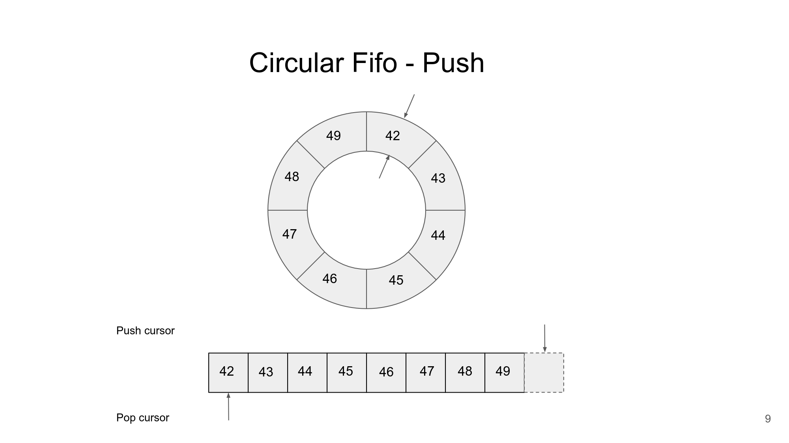
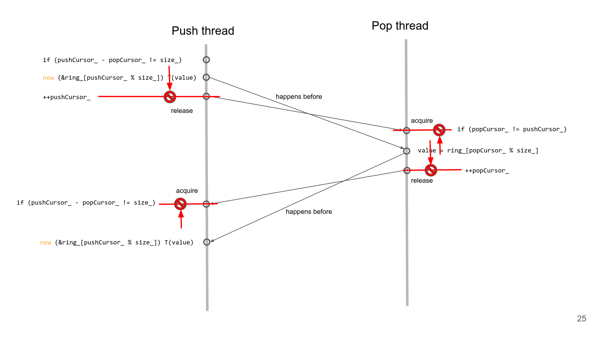

# Lock-free SPSC Ring Buffer

This project is designed for high-throughput, low-latency real-time computing scenarios—such as audio signal processing and high-performance network packet forwarding—featuring zero memory allocation, cache-line alignment, and extreme copy optimizations.

Furthermore, adhering to modern C++ engineering practices, the project fully integrates **Google Test** for unit testing, **Google Benchmark** for micro-benchmarking, and a **GitHub Actions** CI pipeline supporting multiple platforms and compilers.

---

## Lock-free SPSC Ring Buffer Models

SPSC Ring Buffer Schematic Diagram: 

Data Race wihout Happens-Before: 

*[pictures](https://github.com/CppCon/CppCon2023/blob/main/Presentations/SPSC_Lock-free_Wait-Free_Fifo_from_the_Ground_Up_CppCon_2023.pdf) from [CppCon2023: Single Producer Single Consumer Lock-free FIFO From the Ground Up by Charles Frasch](https://www.youtube.com/watch?v=K3P_Lmq6pw0)*

---

### Documents

To understand the lock-free mechanics and low-level optimizations implemented in this project, check out the engineering docs:

* [Concurrency & Atomic](docs/concurrency_and_atomic.md) - analyse the danger of `data race` and discuss how to establish `lock-free` safey boundaries by using `happens-before`
* [Memory Order](docs/memory_order.md) - discuss how to move away from costly `seq_cst` and leverage `acquire`, `release` semantics to squeeze out maximum hardware performance
* [Hardware & Cache](docs/hardware_and_cache.md) - explain the `chache line` mechanism and how to make optimizations by using `alignas` to mitigate `false sharing`
* [Data Copy & Safety](docs/data_copy_and_safety.md) - compile-time assertions(`static_assert`) and how to maximize `contiguous memory throughput` by using `memcpy`
